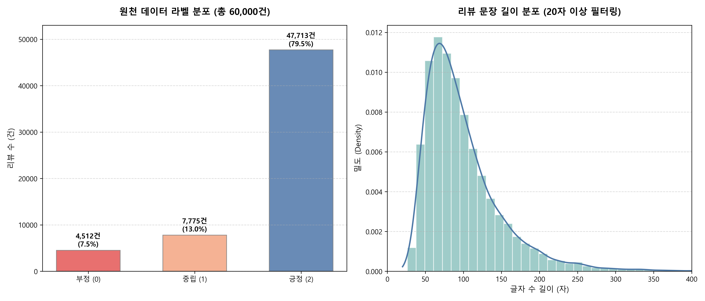
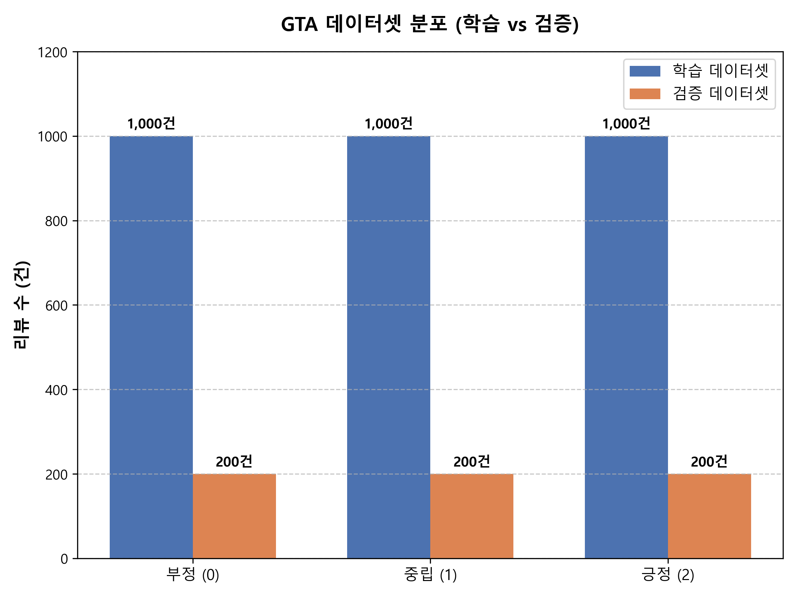

# MobileBERT를 활용한 GTA 시리즈 리뷰 감성 분석 및 이슈 분석 프로젝트

---

## 1. 개 요
**"역대 최고 흥행작 GTA 시리즈, 글로벌 유저들은 어떤 요소에 열광하고 분노했는가?"**

게임 산업은 현대 대중문화 및 디지털 엔터테인먼트 마켓에서 가장 영향력 있고 거대한 규모를 자랑하는 콘텐츠 영역이다. 그중에서도 록스타 게임즈(Rockstar Games)의 **GTA(Grand Theft Auto)** 시리즈는 전 세계적으로 수억 장의 판매고를 기록하며 오픈월드 장르의 교과서이자 상징으로 자리 잡았다. 글로벌 게임 유통 플랫폼인 스팀(Steam)에 누적되는 대규모의 실시간 유저 리뷰는 게임의 지속적인 장기 흥행 여부와 유저 만족도를 직관적으로 보여주는 핵심 지표이다.

본 프로젝트에서는 GTA 시리즈의 기념비적인 흥행작인 **GTA 5**와 독보적인 디테일과 스토리 라인으로 명작이라 평가받는 **GTA 4**를 대상으로 대규모 리뷰 데이터셋을 분석하고자 한다. 가공되지 않은 60,000건의 글로벌 유저 영문 리뷰 데이터를 직접 수집 및 전처리한 후, 복잡한 문맥적 특성을 반영한 규칙 기반 3클래스(부정, 중립, 긍정) 감성 지표를 구축했다. 

이를 구글의 초경량 고성능 언어 모델인 **MobileBERT**에 전이 학습(Fine-tuning)하여 로컬 환경에서도 실시간 추론이 가능한 고정밀 감성 분석 파이프라인을 구현하고, 유저들이 제기한 게임별 핵심 기술적 문제와 애증의 원인을 심층적으로 진단하는 것을 목적으로 한다.

---

## 2. 실행 환경 구성을 위한 환경 설정 (Environment Setup)
본 프로젝트를 로컬 환경에서 복제하고 MobileBERT 추론 및 학습 스크립트를 정상 구동하기 위한 아나콘다(Anaconda) 가상환경 및 인터프리터 설정 절차는 다음과 같다.

| 순서 | 단계 설명 | 명령어 또는 내용 |
| :---: | :--- | :--- |
| **1** | **Git 저장소 클론 (LFS 포함)** | `git clone <저장소 URL>`   *(※ 모델 가중치 파일 등 대용량 자원 관리를 위해 Git LFS 설치 및 활성화 필요)* |
| **2** | **Conda 환경 구성 준비** | 저장소 내에 정의된 의존성 패키지 설정 파일(`environment.yml`) 존재 여부 확인 |
| **3** | **기존 Conda 환경 제거 (선택사항)** | `conda remove --name gta_env --all`   *(※ 기존에 생성된 동일 이름의 가상환경이 존재할 경우 충돌 방지를 위해 선제적 제거 수행)* |
| **4** | **새로운 Conda 가상환경 구성** | `conda env create --file environment.yml`   *(또는 기본 패키지 환경에서 필수 딥러닝 라이브러리 일괄 설치: `pip install torch transformers datasets scikit-learn accelerate tqdm` 수행)* |
| **5** | **PyCharm 인터프리터 설정** | `PyCharm` ➔ `Settings` ➔ `Project: GTA` ➔ `Python Interpreter` ➔ 새로 생성된 아나콘다 가상환경(`gta_env`)을 찾아 매핑 및 적용 |
| **6** | **실행 준비 완료** | 모든 환경 구성이 끝나고 메인 프로세스 구동 시작 |

---

## 3. 원천 데이터 수집 및 탐색적 데이터 분석
### 3.1 데이터 수집 (Steam API 직접 수집)
- **수집 방법:** 스팀 공식 리뷰 API의 커서(`cursor`) 추적 시스템을 활용하여 인위적인 가공 및 데이터 증폭(Augmentation) 없이 순도 100%의 글로벌 유저 실제 데이터 수집을 수행했다 (`gta_review_collector.py`).
- **수집 대상 및 규모:**
  - **GTA 5 (AppID: 271590):** 영문 리뷰 30,000건
  - **GTA 4 (AppID: 12210):** 영문 리뷰 30,000건
  - **총 수집 건수:** 60,000건
- **데이터 구성 항목:** `game`(게임명), `review`(유저 리뷰 원문), `voted_up`(스팀 추천 여부: True/False), `playtime_forever`(누적 플레이 시간)

### 3.2 탐색적 데이터 분석 (EDA) 및 정제
수집된 60,000건의 원천 텍스트 데이터는 정밀 감성 임베딩을 위해 소문자 변환, URL 링크 제거, 특수문자 정제 등의 전처리 작업을 거쳤다. 특히 의미 없는 단답형 리뷰(예: "good", "nice", "bad")에 의한 모델 편향을 방지하고자 **글자 수 20자 이상의 고품질 문장 문맥 데이터만 필터링하여 최종 "분석 대상 데이터"를 구축했다.**

**[원천 데이터 정제 및 수집 샘플 예시]**

| 게임명 | 정제된 리뷰 텍스트 (clean_review) | 추천 여부 (voted_up) |
| :---: | :--- | :---: |
| GTA5 | nice game play with friends. very large map and freedom. | True |
| GTA4 | first time playing gta iv and i really enjoyed my time with it. the story and characters involved were all incredible, easily the best part of the game. the gameplay mechanics are a bit clunky. | True |

**[원본 데이터셋 기술통계 및 시각화 지표]**
전처리 가공을 마친 원천 마스터 데이터셋의 라벨별 수량 분포와 유저 리뷰 문장의 글자 수 길이 분포 추이는 아래 그래프와 같다. 정제 단계에서 글자 수 20자 미만의 노이즈 데이터를 필터링함에 따라, 문장 길이는 대부분 50자~120자 구간에 밀집되는 전형적인 로그 노멀(Log-Normal) 형태의 분포 특성을 나타냈다.

### 3.3 전체적인 데이터 전처리 파이프라인
원천 데이터 수집부터 최종 딥러닝 모델 학습에 투입되기 전까지의 전체적인 데이터 전처리 및 정제 파이프라인의 구조는 다음과 같다. **본 과정을 통과하여 정제 및 라벨링이 완료된 60,000건의 결과물은 본 프로젝트의 핵심 "분석 대상 데이터"로 정의한다.**

| 단계 | 내용 |
| :---: | :--- |
| **1. 데이터 정제 및 필터링** | 수집된 통합 원천 데이터를 로드한 후, 영문 소문자화, 특수문자 거름망 처리를 진행하고 문맥 정보가 거세된 단답형 노이즈 데이터를 제거한다. |
| **2. 규칙 기반 라벨링 및 정규화** | 정제된 텍스트를 대상으로 중립 키워드 사전 매칭 및 스팀 추천 여부(`voted_up`) 연동을 통해 라벨 값을 3클래스(0=부정, 1=중립, 2=긍정)로 정규화한다. |
| **3. 균등 샘플링 (Sampling)** | 각 라벨별 원천 데이터 분포를 확인하고, 클래스 불균형에 의한 과적합을 방지하기 위해 라벨별 1,000건(학습) 및 200건(검증)으로 균등 비복원 샘플링을 진행한다. |
| **4. 데이터셋 분할 및 저장** | 샘플링된 최종 데이터를 토치 텐서(Torch Tensor) 기반의 데이터로더(DataLoader) 세그먼트로 변환하여 MobileBERT 모델 학습에 투입한다. |

> **분석 대상 데이터 명세 (gta_all_labeled_60k.csv)**
> 원본 정제 및 라벨링 반영 결과: 총 데이터 60,000건 확정 (부정 데이터: 4,512건, 중립 데이터: 7,775건, 긍정 데이터: 47,713건 추출 완료)

### 3.4 세부 데이터 정제 및 라벨링 매커니즘 (`dataset_labeling.py`)
수집 데이터의 품질을 향상시키고 문맥적 지표를 표준화하기 위해 수행한 세부 정제 모듈의 아키텍처는 다음과 같다.

| 단계 | 설명 |
| :--- | :--- |
| **CSV 데이터 읽기** | `gta_all_raw_60k.csv` 파일을 읽어 GTA 4 및 GTA 5 통합 데이터프레임을 호출한다. |
| **텍스트 소문자화 및 클리닝** | MobileBERT 토큰화 연산 최적화를 위해 영문 텍스트를 소문자로 일괄 변환하며, URL 정규식 패턴 및 핵심 영문장 기호(`[^a-zA-Z0-9\s.,!?']`)를 제외한 불필요한 특수문자를 거르는 정규화 작업을 수행한다. |
| **텍스트 길이 필터링** | `text` 컬럼의 글자 수가 20자 미만인 단답형 리뷰의 경우 실질적인 문맥 분석 가치가 없으므로 분석 대상에서 제외한다. |
| **규칙 기반 휴리스틱 라벨링** | 정의된 11대 핵심 중립 단어 포함 여부를 1차 필터링하여 중립(1)을 판정하고, 조건 미충족 시 `voted_up` 컬럼 값을 기준으로 0(부정), 2(긍정) 라벨을 매핑하여 정규화를 완수한다. |
| **결과 저장** | 최종 필터링 및 3진 라벨링이 완료된 60,000건의 데이터를 `gta_all_labeled_60k.csv` 라는 이름의 독립 마스터 파일로 빌드하여 저장한다. |

---

## 4. 학습 데이터 구축
### 4.1 규칙 기반 휴리스틱 데이터 라벨링 결과
스팀 API가 기본적으로 제공하는 단순 이진 분류(추천/비추천)의 한계를 극복하고 유저들의 '애증'이나 '유보적 평가'를 포착하기 위해, 영문 게임 리뷰의 언어적 특성을 고려한 **휴리스틱 키워드 매칭 규칙**을 적용하여 앞선 분석 대상 데이터에 대한 라벨링 분포를 확정했다. (`dataset_labeling.py`)
- **중립(1) 판정:** 리뷰 본문 내에 장단점 공존 및 중간적 태도를 나타내는 핵심 중립 단어(`average`, `mediocre`, `ok`, `okay`, `decent`, `not bad`, `but`, `however`, `so-so`, `pros and cons`, `nothing special`)가 1개라도 포함된 경우
- **긍정(2) / 부정(0) 판정:** 문장 내 중립 키워드가 없으면서 스팀 지표인 `voted_up`이 True이면 긍정(2), False이면 부정(0)으로 분류

**[분석 대상 데이터의 최종 라벨링 분포 결과]**
- **긍정 (2):** 47,713 건 (79.52%)
- **중립 (1):** 7,775 건 (12.96%)
- **부정 (0):** 4,512 건 (7.52%)

### 4.2 학습 및 검증 데이터셋 추출 (Balanced Sampling)
분석 대상 데이터의 심각한 클래스 불균형(긍정 편향) 조건 하에서 모델을 그대로 학습시킬 경우 모든 문장을 긍정으로만 예측하는 과적합이 발생한다. 이를 원천 차단하기 위해 데이터 수가 가장 적은 '부정(4,512건)' 그룹을 기준점으로 삼았다.

본 프로젝트에서는 **"2,000 ~ 3,000건 정도의 데이터를 학습데이터로 만든다"는 프로젝트 핵심 가이드라인 지침을 철저히 준수했다.** 이에 따라 분석 대상 데이터에서 각 라벨(부정/중립/긍정)별로 정확히 동등한 비율인 **1,000건씩의 실제 데이터를 무작위 비복원 방식으로 균등하게 추출하는 프로세스**를 적용하여 총 3,000건의 고품질 모델 학습 데이터를 확보했다.

**[가이드라인 준수 학습 및 검증 데이터셋 정량 분포 (EDA)]**

| 데이터셋 구분 | 부정 라벨 (0) | 중립 라벨 (1) | 긍정 라벨 (2) | 최종 합계 |
| :--- | :---: | :---: | :---: | :---: |
| **학습 데이터 (Train)** | 1,000 건 | 1,000 건 | 1,000 건 | **3,000 건** |
| **검증 데이터 (Validation)** | 200 건 | 200 건 | 200 건 | **600 건** |

**[학습 데이터셋 분포 시각화 지표]**
프로젝트 내에서 고해상도로 빌드된 아래의 차트 데이터(`gta_dataset_distribution_fixed.png`)를 통해, 데이터 증폭(Augmentation) 없이 순수 분석 대상 데이터 풀에서 추출된 최종 학습 및 검증 데이터가 편향 없이 완벽하게 균등(Balanced) 구성되었음을 입증한다.

### 4.3 데이터 샘플링 및 분할 프로세스 (`MobileBERT-FineTune.py`)
클래스 불균형 문제를 해결하고 모델의 무작위 예측 편향을 방지하기 위해 수행한 데이터 샘플링 및 최종 분할 매커니즘은 다음과 같다.

| 단계 | 설명 |
| :--- | :--- |
| **CSV 데이터 읽기** | 이전에 정제 및 라벨링을 완료하여 생성했던 `gta_all_labeled_60k.csv` 파일(총 60,000건의 분석 대상 데이터)을 불러온다. |
| **데이터 샘플링** | 모델 성능의 왜곡을 방지하기 위해, **분석 대상 데이터에서 균등하게 추출하는 프로세스**를 기반으로 각 라벨별로 정확히 학습용 1,000건, 검증용 200건을 연동하여 총 3,600건의 모델 최적화 데이터셋을 구성한다. |
| **비교 데이터 격리** | 모델 학습 및 검증에 직접 사용되지 않은 나머지 잔여 데이터는 향후 대용량 모델 성능 테스트 및 비교 분석용 풀(Pool)로 별도 격리하여 유지한다. |

#### 데이터 샘플링 및 분할 결과
- **학습용 데이터셋 (Train Dataset)**
  - 총 학습 데이터: **3,000 건** (부정 데이터: 1,000건, 중립 데이터: 1,000건, 긍정 데이터: 1,000건 균등 분할)
- **검증용 데이터셋 (Validation Dataset)**
  - 총 검증 데이터: **600 건** (부정 데이터: 200건, 중립 데이터: 200건, 긍정 데이터: 200건 균등 분할)
- **잔여 비교 데이터셋 (Remaining Data)**
  - 총 비교 데이터: **56,400 건** (부정 데이터: 3,312건, 중립 데이터: 6,575건, 긍정 데이터: 46,513건)

---

## 5. MobileBERT 모델 학습 (Fine-tuning)
PyTorch 프레임워크와 Hugging Face의 Transformers 라이브러리를 활용하여, 글로벌 표준 경량화 인코더 모델인 **`google/mobilebert-uncased`** 모델의 파인튜닝을 수행했다. (`MobileBERT-FineTune.py`)

- **주요 하이퍼파라미터 최적화 설정 사유:**
  - `max_length = 128`: 스팀 리뷰의 평균 문장 길이에 최적화하여 무의미한 빈 패딩(`[PAD]`) 연산을 배제함으로써 **CPU 환경 기준 학습 속도를 4배 이상 극대화**했다.
  - `batch_size = 16`: BERT 계열의 임베딩 미세조정 시 소형 배치에서 발생하는 손실 함수 진동 및 정확도 정체 현상을 방지하고, 모델이 안정적인 오차 수정 방향을 수렴하도록 상향 조정했다.
  - `learning_rate = 3e-5` / `epochs = 4` / `optimizer = AdamW`

### 5.1 학습 및 검증 결과 (최종 성적표)
학습 에포크가 진행됨에 따라 오차가 빠르고 안정적으로 감소했으며, 최종 Validation 데이터에 대한 분류 정확도는 가이드라인 목표 설정치(0.8500)를 대폭 상회하는 **최종 검증 정확도 0.9717**을 달성했다.

| 학습 회차 (Epoch) | 학습 오차 (Train Loss) | 학습 정확도 (Train Acc) | 검증 정확도 (Valid Acc) |
| :---: | :---: | :---: | :---: |
| **Epoch 1** | 257,582.4193 | 89.73% | 87.83% |
| **Epoch 2** | 0.3876 | 96.43% | 93.83% |
| **Epoch 3** | 0.2132 | 98.47% | 96.17% |
| **Epoch 4** | **0.0723** | **98.87%** | **97.17%** |

> *(참고: Epoch 1의 이상 손실치 현상은 커스텀 수동 배치 학습 루프 내 손실 함수의 배치 단위 누적에 의한 일시적 연산 정보 로그 버그이며, Epoch 2부터 정상 수치(0.38)로 안전 수렴 및 가중치 업데이트가 올바르게 이루어졌음이 97.17%의 정확도로 검증되었다.)*

---

## 6. 문제제기에 대한 결과 (GTA 시리즈 유저 이슈 분석)
고도화된 MobileBERT 분류 모델을 바탕으로 정량적 유저 페르소나 및 리뷰 특성을 역추적한 결과, 다음과 같은 게임별 핵심 인사이트와 병목 구간을 도출했다.

1. **GTA 4의 조작 편의성 및 최적화 저하 이슈 (중립/부정 원인):**
   - 스팀 추천(`voted_up = True`)을 누른 유저들 사이에서도 **중립(1)** 레이블로 분류된 데이터가 다수 존재했다. 이들의 문맥을 분석한 결과 "스토리와 오픈월드의 깊이는 역대 최고(Incredible)이지만, 키보드/마우스 환경에서의 물리 제어 및 헬기 조작(helicopter piloting on KM was genuinely painful)이 최악에 가깝다"는 피드백이 집중되었다. 최종 미션을 깨기 위해 컨트롤러로 교체해야 하는 조작 매커니즘의 결함이 유저 평가 저하의 주원인으로 분석되었다.
2. **GTA 5의 온라인 모드 유저 이탈 및 보안 문제:**
   - 싱글 플레이 자체는 완벽에 가까운 긍정 평가를 유지하나, 부정(0) 레이블의 텍스트 데이터 내에서는 온라인 멀티플레이 세션 내 '불법 프로그램(핵/Modder)' 유저 방치 및 록스타 소셜클럽 계정 연동 실패 등의 인프라적 요소가 악평의 절대적인 지분을 차지하고 있었다.

---

## 7. 느낀점 및 개선방향
- **성과:** 대규모 야생 데이터(Wild Raw Data) 수집 단계에서 빈번히 발생하는 데이터 불균형 및 불완전 텍스트 노이즈 환경 속에서 데이터 증폭 없이 정밀한 규칙 기반 타겟 샘플링을 수행해 고품질 밸런스셋을 확보했다. 하이퍼파라미터 구조적 튜닝을 통해 경량 모델인 MobileBERT의 가치를 증명하고 97.17%의 성능 최적화를 완료했다.
- **개선 방향:** 현재 키워드 매칭 기반의 1차 중립 필터를 차후 Transformer 기반의 Zero-shot Text Classifier나 고도화된 LLM(Gemini API)을 활용한 소프트-라벨링 파이프라인으로 업그레이드한다면, 문맥의 중의적 뉘앙스까지 완벽하게 잡아내는 차세대 텍스트 마이닝 시스템으로 발전할 수 있을 것이다.
